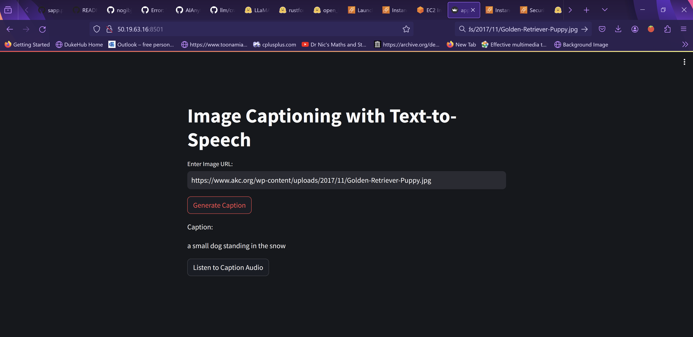
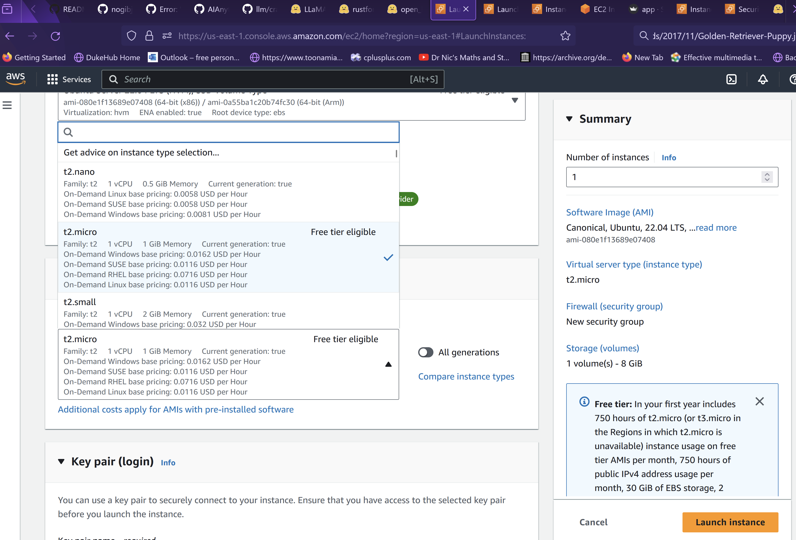
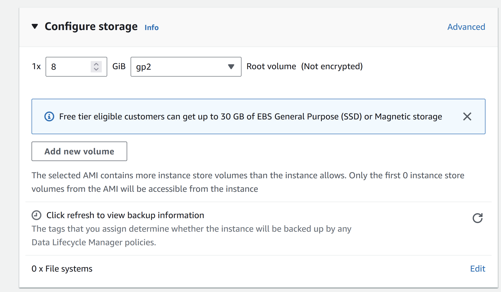
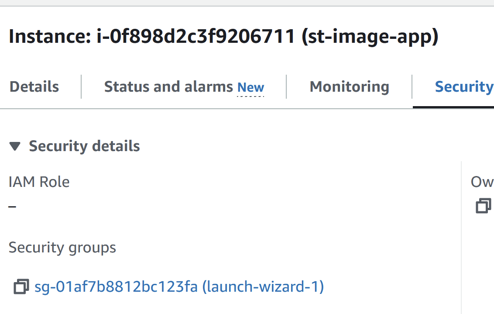
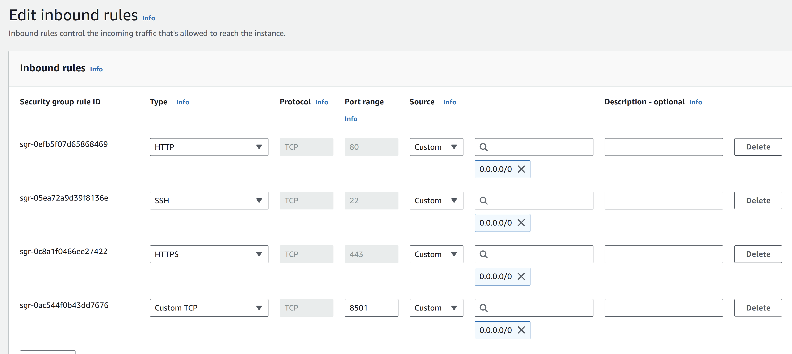
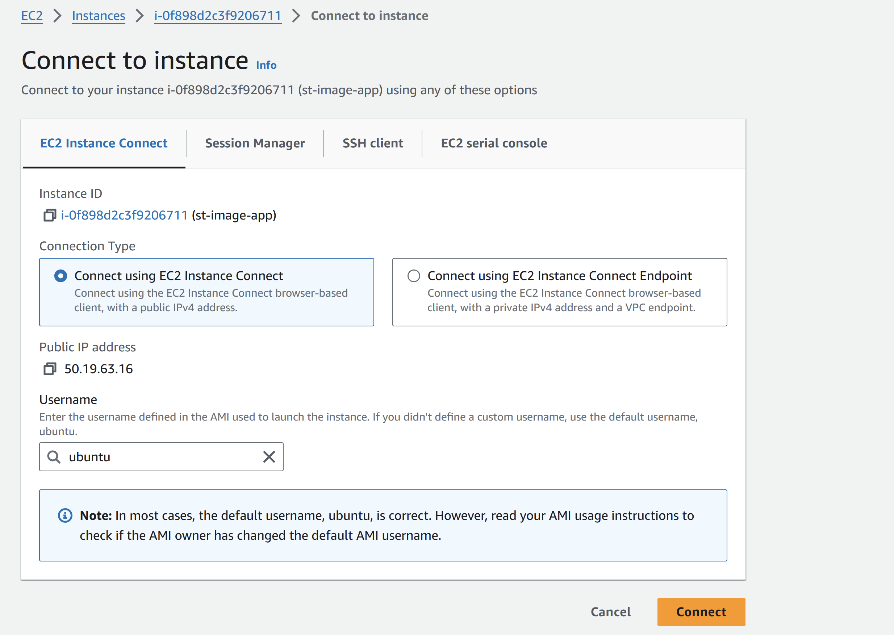
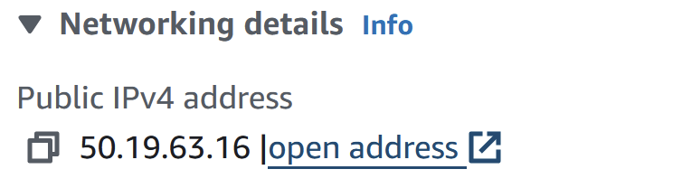

# Caption Your Image - Deploy a Streamlit App on EC2

## Description
In this project, we deploy a streamlit app that captions images from urls on an EC2 instance. This project takes inspiration from DSwithBappy's [tutorial](https://www.youtube.com/watch?v=DflWqmppOAg) on how to deploy on EC2 and expose a public link. As such, I won't restate too much of what he mentioned. 

[Click Here for this Project's Overview Demo Video!!!](https://youtu.be/0wCvsfkFGwY)


## Usage

EC2 Web App Link : http://50.19.63.16:8501/

    Note : I will deactivate the link after 10 days

At the link, provide an image url that ends with an jpg, jpeg or png or other valid image type. Then click generate caption and listen to caption audio if you want to hear the text being spoken.




## Setup

To run the code locally, opt for one of these two options.

```
# local
pip install -r requirements.txt
python3 -m streamlit run app.py

```
## Setup Instructions

1. Make an app.py and write your logic. I opted for this model configuration because EC2 ubuntu raised too many errors with other model configurations. I'll come back to this detail in the later steps.
```
# snippet
import streamlit as st
import requests
from PIL import Image
from io import BytesIO
from transformers import GPT2TokenizerFast, ViTImageProcessor, VisionEncoderDecoderModel
from gtts import gTTS

# Load a fine-tuned image captioning model and corresponding tokenizer and image processor
model = VisionEncoderDecoderModel.from_pretrained("nlpconnect/vit-gpt2-image-captioning")
tokenizer = GPT2TokenizerFast.from_pretrained("nlpconnect/vit-gpt2-image-captioning")
image_processor = ViTImageProcessor.from_pretrained("nlpconnect/vit-gpt2-image-captioning")
```

2. EC2 Instance Creation - I chose a lightweight model to avoid using a pricey instance type for when I would expose the public link. This is discussed in Bappy's video. One thing worth highlighting is that some models are ram hungry and/or storage hungry. Do make sure to choose the right configuration for your needs. Here are pictures to illustrate what to modify.

    Instance Type



    Storage


3. Prepare the port for streamlit on the EC2 instance. Navigate to security and click the security group link. Click Edit Inbound Rules. Add a Custom TCP port 8501 with route 0.0.0.0, since that is the port that streamlit uses by default.





4. Connect to the instance and run the following commands, as suggested by Bappy. Hit enter anytime you get screens asking for permissions to continue. The final command allows the app to run indefinitely without having to stop it. Here is an image of what you would see at the end.



```
# prepare environment
sudo apt update
sudo apt-get update
sudo apt upgrade -y
sudo apt install git curl unzip tar make sudo vim wget -y
git clone "your-repository"
sudo apt install python3-pip
cd "your-repository"
pip install -r requirements.txt
python3 -m streamlit run app.py
# to run indefinitely : optional
nohup python3 -m streamlit run app.py
```


5. Find the public address of your EC2 instance at the Networking section. Add the port number as ":8501" at the end of that to use your streamlit app. 




6. Final Step: Enjoy your app by opening the link in a new tab.


## Licenses
Creative Commons.

## Status
This project is complete as of April 2024.
